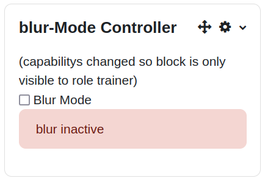
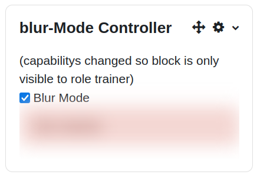

<b>About this code:</b>  
In some cases when you show an user your moodle course you do not want to show data like name of students for data privacy reason.  
This code can be used to add a blur-functionality to a course so that some data is blured.  
You can turn blur mode on and of using the local storage of the browser to remember the setting on all pages.  
The block has to be configured to be displayed on ALL pages of the course so that the block add the functionality on all pages eg participant page.  

Blur mode inactive  

Blur mode active  

